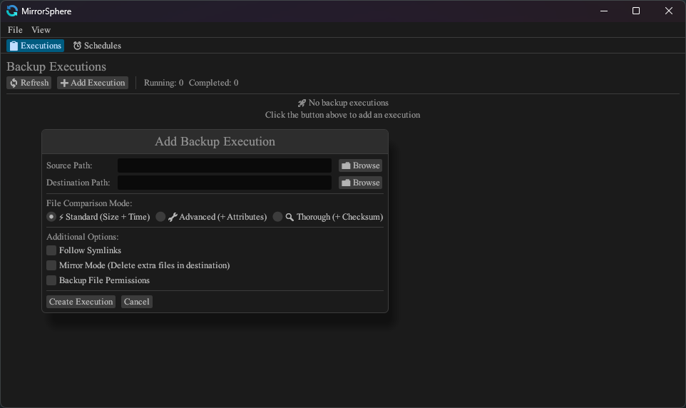
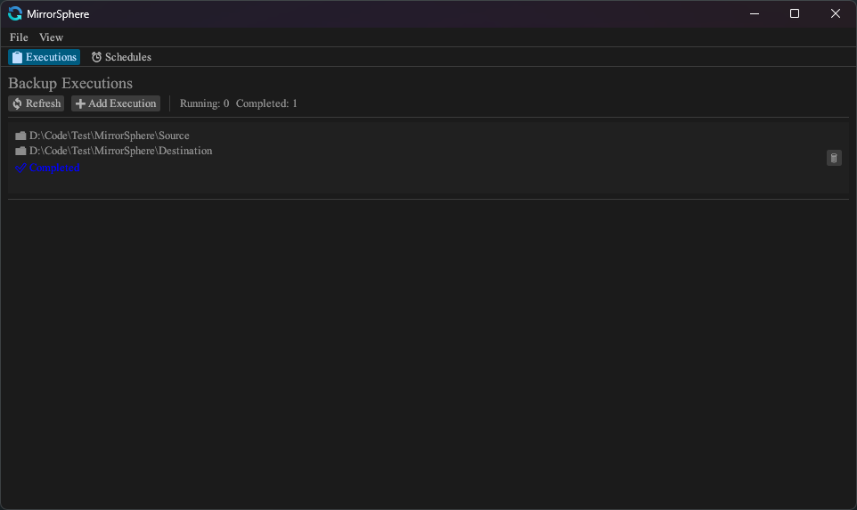
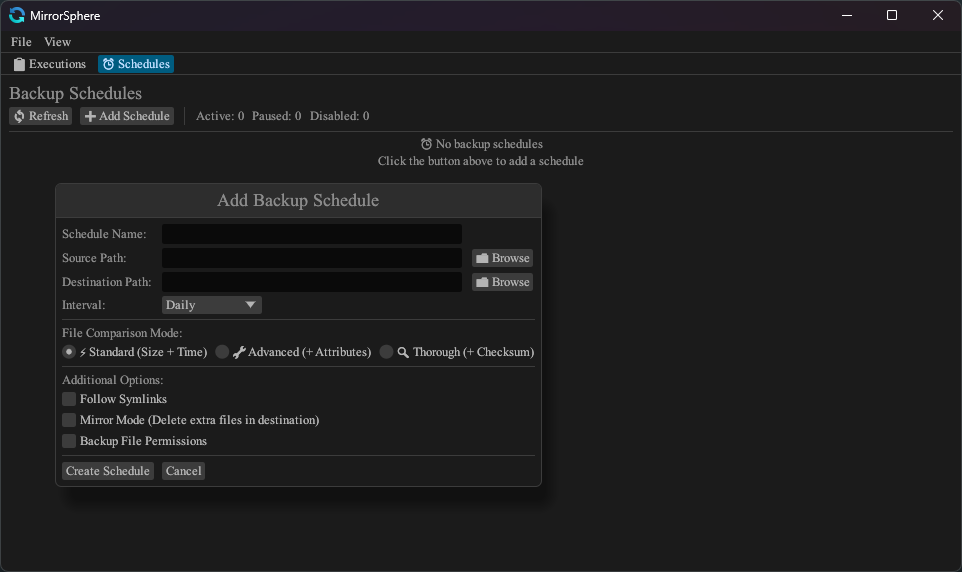
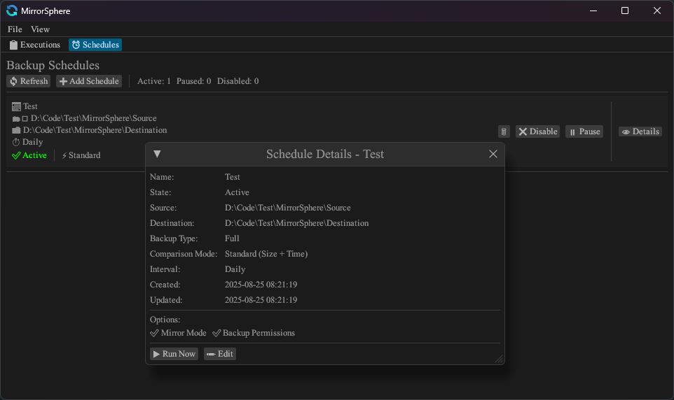

# MirrorSphere

A powerful, cross-platform backup and file synchronization tool built with Rust, featuring both manual execution and automated scheduling capabilities.

## Features

### Core Functionality
- **Multiple Backup Types**: Full backup and incremental backup support
- **File Comparison Modes**: Standard (size + modification time), Advanced (+ attributes), Thorough (+ hash verification)
- **Mirror Mode**: Maintains exact replica by removing extra files in destination
- **Symlink Handling**: Choose to follow symlinks or copy them as-is
- **Permission Backup**: Preserve file permissions and attributes
- **Source File Locking**: Prevent modifications during backup process

### Scheduling System
- **Flexible Intervals**: Once, Daily, Weekly, Monthly scheduling
- **Schedule Management**: Create, modify, pause, resume, and disable schedules
- **Automatic Execution**: Background scheduler with configurable timing
- **Persistent Storage**: SQLite database for schedule persistence

### User Interface
- **Modern GUI**: Built with egui for cross-platform compatibility
- **Real-time Progress**: Live updates on backup progress and current operations
- **Error Tracking**: Comprehensive error logging and display
- **Task Management**: Start, pause, resume, and monitor backup executions

### Technical Features
- **Multi-threading**: Configurable concurrency for optimal performance
- **Progress Recovery**: Resume interrupted backups from last checkpoint
- **Hash Algorithms**: MD5, SHA256, SHA3, BLAKE2B, BLAKE2S, BLAKE3 support
- **Cross-platform**: Windows and Linux support with platform-specific optimizations

## Installation

### Prerequisites
- Rust 1.85+ (2024 edition)

### Building from Source

```bash
# Clone the repository
git clone https://github.com/DaLaw2/MirrorSphere
cd MirrorSphere

# Build the project
cargo build --release

# Run the application
cargo run --release
```

## Configuration

### Config File (config.toml)
```toml
[Config]
internal_timestamp = 100     # Internal timing in milliseconds
ui_refresh_time = 2          # UI refresh interval in seconds
default_wakeup_time = 30     # Default scheduler wake-up time in seconds
max_concurrency = 4          # Maximum concurrent backup workers
max_file_operations = 100    # Maximum concurrent file operations
```

## Screenshots

### Main Interface






*The main execution management interface showing backup tasks, progress tracking, and control options.*

## Usage

### GUI Interface

1. **Executions Tab**: Manage manual backup tasks
    - Create new backup executions
    - Monitor progress in real-time
    - Start, pause, resume, or cancel operations
    - View detailed error logs

2. **Schedules Tab**: Manage automated backups
    - Create scheduled backup tasks
    - Set intervals (Once, Daily, Weekly, Monthly)
    - Enable, pause, or disable schedules
    - View execution history and next run times

### Backup Options

- **Mirror Mode**: Remove files from destination that don't exist in source
- **Lock Source**: Lock source files during backup to prevent modifications
- **Backup Permissions**: Preserve file permissions and attributes
- **Follow Symlinks**: Follow symbolic links instead of copying them

### Comparison Modes

1. **Standard**: Compare file size and modification time
2. **Advanced**: Standard comparison + file attributes
3. **Thorough**: Advanced comparison + cryptographic hash verification

## Platform Support

### Windows
- UAC elevation for administrator privileges
- Windows-specific file attributes and permissions
- NTFS symlink support
- Windows API integration for file operations

### Linux
- Root privilege handling
- POSIX file permissions and attributes
- Unix-style symlink support
- Extended attribute support

## Future Features

The following features are planned for future development as time and interest permits:

### Cloud Storage Integration
- **Multiple Cloud Providers**: Amazon S3, Google Cloud Storage, Azure Blob Storage
- **Cloud Synchronization**: Direct backup to cloud storage with incremental sync

### Advanced File System Features
- **NTFS USN Journal Support**: Real-time change detection on Windows for efficient incremental backups
- **High-Performance I/O**: IOCP (Windows) and io_uring (Linux) support for better async performance
- **File System Monitoring**: Real-time file change notifications to trigger automatic backups

### Platform Expansion
- **macOS Support**: Complete cross-platform coverage with Apple File System (APFS) optimizations
- **Mobile Companion Apps**: iOS/Android apps for monitoring and basic management

### System Integration
- **Operating System Services**: Register as Windows Service, Linux systemd daemon, or macOS Launch Daemon
- **Background Operation**: Run silently in the background without user interaction
- **System Startup**: Automatic startup with the operating system

### Additional Ideas
- Enhanced security with encryption and authentication

*Note: This is a wish list of potential features, not a committed roadmap. Development priorities may change based on personal interest and available time.*

## Support

For issues, questions, or contributions, please use the GitHub issue tracker.